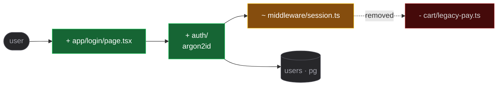

# PR body rules

Rules and sample outputs for the PR body skeleton in [../template.md](../template.md).

## Summary rules

- 1 to 4 bullets max.
- One short sentence per bullet, starting with an imperative verb.
- Audience is non-developers — explain WHAT and WHY, never HOW.
- No file paths, no function names, no class names, no internal jargon.

## Example — feat

```
## Summary

- Add a password reset flow so users locked out of their account can recover access.
- Email a one-time link valid for 30 minutes.
```

## Example — fix

```
## Summary

- Stop archived projects from showing up in the dashboard list.
- Return a clear error when someone tries to open one directly.
```

## Changes canvas

A mermaid canvas showing what the change did to the tree. Reviewer-facing — the no-paths, no-jargon rule above applies to the Summary ONLY, never here.

Include it when the change adds, moves, or removes a module, or crosses a boundary. Skip it for a single-file edit, a copy change, a version bump, or a config tweak — never draw a canvas for one fact.

- Fenced `mermaid` block using `flowchart LR`.
- Use `TD` instead when the tree is deeper than it is wide.
- Shape carries type, orthogonal to color: `([entry point])`, `[(datastore)]`, `{{external service}}`, plain rectangle for the rest.
- Grey unchanged context nodes with a `ctx` class so the delta stands out. Include them only when they orient the reviewer.
- One `subgraph` per top-level directory.
- Prefix every changed node with `+`, `~`, or `-`. Show the delta only, never the whole repo.
- Solid arrow for a live dependency, dotted for one that was removed.
- Quote every node label, as in `P["login/page.tsx"]`, so slashes and dots do not break the parse.
- Cap it at roughly twelve nodes; past that collapse a subsystem into one node.
- Color the four change states with `classDef` — added, changed, removed, blocker. Never decorative; the color reinforces the `+` `~` `-` prefix rather than replacing it.

Example:



## Optional — Test plan (opt-in)

Only add this section when the user explicitly asks for it:

```
## Test plan

- [ ] <verifiable check>
- [ ] <verifiable check>
```

## What to avoid

In the Summary only — the Changes canvas is exempt.

- File paths (`src/foo/bar.ts`).
- Function or class names (`resetPassword()`, `BillingService`).
- Implementation jargon (`refactored the reducer`, `bumped the lockfile`).
- Marketing fluff or vague verbs (`improve`, `enhance`, `tweak`).
