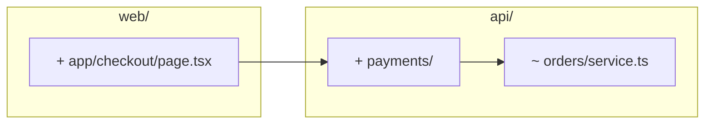

# PR body template

Fill in this skeleton, then hand the result to `gh pr create --body`.

````
## Summary

- <imperative sentence describing a user-visible change>
- <imperative sentence describing another user-visible change>

## Changes


````

`## Summary` is 1 to 4 bullets for non-developers. `## Changes` is a mermaid canvas for reviewers — include it only when the change moves structure. For the wording rules, the canvas rules, sample outputs, the opt-in `## Test plan` section, and what to avoid, see [reference/pr-body-rules.md](./reference/pr-body-rules.md).
